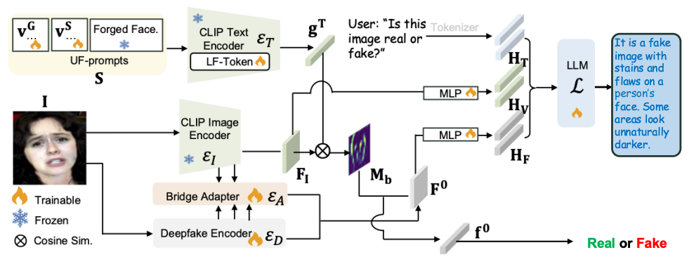

# Forged Face Detection 

This repository contains the implementation and the dataset of the paper: Rethinking Vision-Language Model in Face Forensics: Multi-Modal Interpretable Forged Face Detector (CVPR2025)

> Deepfake detection is a long-established research topic vital for mitigating the spread of malicious misinformation.
Unlike prior methods that provide either binary classification results or textual explanations separately, we introduce a novel method capable of generating both simultaneously. Our method harnesses the multi-modal learning
capability of the pre-trained CLIP and the unprecedented
interpretability of large language models (LLMs) to enhance both the generalization and explainability of deepfake detection. Specifically, we introduce a multi-modal
face forgery detector (M2F2-Det) that employs tailored
face forgery prompt learning, incorporating the pre-trained
CLIP to improve generalization to unseen forgeries. Also,
M2F2-Det incorporates an LLM to provide detailed textual explanations of its detection decisions, enhancing interpretability by bridging the gap between natural language
and subtle cues of facial forgeries. Empirically, we evaluate M2F2-Det on both detection and explanation generation tasks, where it achieves state-of-the-art performance,
demonstrating its effectiveness in identifying and explaining diverse forgeries.

<p align="center">
  
</p>

## Setup
### Dataset
Two main datasets used are FF++ and DDVQA, which can be acquired via: 

**FF++**: We offer a preprocessed FF++ dataset in the HDF5 file format [link](https://drive.google.com/drive/folders/1ovuurFCkBfmcMq7HKO5ph36U1QyL75UA?usp=sharing). The dataset follows the naming ```FF++_{manipulation_type}_{compression rate}.h5``` and is structured as follows:
```
FF++_Deepfakes_c23.h5:
FF++_Deepfakes_c40.h5
FF++_Face2Face_c23.h5
FF++_Face2Face_c40.h5
```
**DDVQA**: please download the dataset from [[link]](https://github.com/Reality-Defender/Research-DD-VQA).

### Environment
To create your environment by
```bash
conda env create -f environment.yml
```
or refer to the LLaVA-v1.5 environment

### Pre-trained Weights: 
Please acquire the pre-trained weights from the Google Drive [[link]](https://github.com/Reality-Defender/Research-DD-VQA).

## Run

### Train 
We use a three-stage training procedure as follows:

#### Stage-1: A Binary Detector Training
After setting up the dataset and environment, please run the following command, which produces **Stage-1-weights** (pre-trained binary detector weights in ```*.pth```). 

```bash
bash run_stage_1.sh
```

<details>
<summary>Note</summary>
  
  1. The pre-trained CLIP image encoder is the ```vision_tower.pth```, which must match the LLaVA version used, and LLaVA's CLIP encoder differs from the one imported ```CLIP transformers```. If using a new CLIP-based model, load weights from LLaVA's pretrained models from scratch~

  2. In ```M2F2Det/models/model.py```, preprocessing is defined in the ```forward()``` function without additional pipeline preprocessing. This originates from LLaVA's preprocessing flow. New models must use identical preprocessing here to ensure input consistency when integrated into LLaVA.
</details>

#### Stage-2: Multi-Modal Alignment

We merge **LLaVA-1.5-7b** and **Stage-1 weights** to initialize **LLaVADeepfakeCasualLM**, which needs to modify ```config.json``` of the base model (_i.e._, LLaVA-1.5-7b). Refer to ```LLaVA/examples/LLaVA_config.json``` for details.

<details>
<summary>JSON Note</summary>
 Updated JSON file note:
  
```json
{
  "_name_or_path": "LLaVA-1.5-7b",
  ...
  "deepfake_model_name": "densenet121",  // Detector type, we provide the code base for densenet and efficient. 
  "deepfake_model_path": "/path/to/your/Stage-1 weights",  // Stage-1 weights.
  "mm_vision_select_feature": "cls_patch",  // Changed from 'patch' to 'cls_patch'
  ...
}
```

Also, it is also helpful to set ```low_cpu_mem_usage=False``` in around ```LLaVA/model/builder.py```#L246.
</details>

Run the following code to randomly initialize specific MLP layers, which produces **Stage-2-init-weights**. This merging code is ```merge_stage23.sh```. 
```bash
python scripts/merge_lora_weights_deepfake_random.py \
  --model-path LLaVA-1.5-7b-with-updated-config \
  --save-model-path new_model_path
```

Using **Stage-2-init-weights**, the following trains MLP layers and results in **Stage-2-weights-Delta**.
```bash
bash scripts/finetune_stage_2.sh
```

<a name="key1"></a>
<details>
<summary>Key parameters</summary>
 Key parameters to modify in the script:
  
```bash
--model_name_or_path    # Stage-2-init-weights
--data_path             # Training data JSON
--image_folder          # Base path prefix for "image" keys in data
--vision_tower          # CLIP path (we use openai/clip-vit-large-patch14-336.)
--deepfake_ckpt_path    # Pretrained detector weights, check *.pth from Stage-1-weights.
--output_dir            # Output directory for Stage-2-weights-Delta.
```
</details>


After fine-tuning, ```merge_stage23.sh``` merges **Stage-2-weights-Delta** with **Stage-2-init-weights** into **Stage-2-weights** as:
```
python scripts/merge_lora_weights_deepfake.py
  --model_path Stage-2-weights-Delta \
  --model_base Stage-2-init-weights \
  --save_path your_path
```

#### Stage-3: LoRA Finetuning.
Using the **Stage-2-weights**, the following command conducts the LoRA fine-tuning to generate **Stage-3-weights-Delta**. 
```bash
bash scripts/finetune_stage_3.sh
```

<details>
<summary>Key parameters</summary>
 Key parameters to modify in the script:
  
```bash
--model_name_or_path    # Stage-2-weights
--output_dir            # Output directory for Stage-3-weights-Delta.
```
[more defined parameters](#key1)
</details>

After training, ```merge_stage3.sh``` merges **Stage-3-weights-Delta** into **Stage-3-weights** for the inference. 
```bash
python scripts/merge_lora_weights_deepfake.py \
  --model_path Stage-3-weights-Delta \
  --model_base Stage-2-weights \
  --save_path your_path
```

### Inference
For the terminal interface, please set the correct model path and then run 
```bash
bash launch-cli-deepfake_test.sh.  // an interactive mode for user-assistant deepfake conversation.
bash launch-cli-deepfake_test.sh.  // running the pre-trained weights on the DDVQA dataset. 
```

## Gradio Demo
Please refer to the LLaVA repos at [link](https://github.com/haotian-liu/LLaVA?tab=readme-ov-file#demo).

### Reference
If you would like to use our work, please cite:
```Bibtex
@inproceedings{ M2F2_Det_xiao,
  author = { Xiao Guo and Xiufeng Song and Yue Zhang and Xiaohong Liu and Xiaoming Liu },
  title = { Rethinking Vision-Language Model in Face Forensics: Multi-Modal Interpretable Forged Face Detector },
  booktitle = { In Proceeding of IEEE Computer Vision and Pattern Recognition },
  address = { Nashville, TN },
  month = { June },
  year = { 2025 },
}
```
